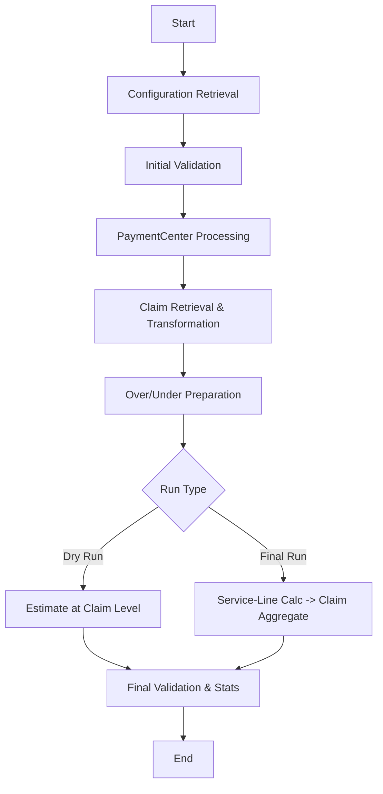

# Payment Processing Flow

## Executive summary

This document specifies the end-to-end PaymentEvent processing flow used to generate payments for providers and members, including data sources, collections, validation, calculation logic, and performance strategy. It is intended for backend/data engineers, QA, and product owners who operate and maintain the PaymentEvent process.

Why it matters: A clear, validated, and dry-run–first process reduces payment errors, shortens QA cycles, and makes production runs safer and more auditable.

## Table of contents

- [Executive summary](#executive-summary)
- [Goals](#goals)
- [Terminology / Glossary](#terminology--glossary)
- [High-level flow](#high-level-flow)
- [Collections](#collections)
- [Process steps](#process-steps)
    - [Pre-Run (Estimate / Dry Run)](#pre-run-estimate--dry-run)
    - [Final Run (Production)](#final-run-production)
- [Validation and checks](#validation-and-checks)
- [ClaimTransformation](#claimtransformation)
- [Payment calculation](#payment-calculation)
- [OverAndUnderPayment lifecycle](#overandunderpayment-lifecycle)
- [Performance and parallelism](#performance-and-parallelism)
- [Project structure](#project-structure)
- [Runbook / Quick start](#runbook--quick-start)
- [Open questions / TODOs](#open-questions--todos)
- [Review checklist](#review-checklist)
- [Next steps](#next-steps)
- [Changelog](#changelog)

## Goals

- Provide a precise, reproducible specification for PaymentEvent processing across Dry Run and Final (Production) stages.
- Preserve and clarify business logic and data-model specifics for PaymentEvent, PaymentCenter, claims, and payment calculations.
- Define validations, outputs, and performance strategies with clear responsibilities and failure modes.
 - Standardize connection handling: use a single DB connection string (db_uri) for all fetch and update operations across the run.

## Terminology / Glossary

- PaymentEvent: A configured payment cycle run. Includes PaymentEvent_ID, Business info, InclusionCriteria_ID, FundingSource_ID, Payment Due Date (for interest), PaymentEventType ('Provider' or 'DMR'), and Stage. Owner: TBD.
- PaymentCenter: The unit of payee aggregation. Types: Provider (TaxID + NPI) and Member (MemberID). Owner: TBD.
- PaymentCenterWS: Working set for PaymentCenter during Dry Run; contains copies of existing PCs flagged OLD and newly created PCs flagged NEW for validation. Owner: TBD.
- PaymentEventWS: Working set for PaymentEvent configuration cloned from PaymentEvent for Dry Run consolidation at PaymentCenter level. Owner: TBD.
- ClaimWSCore: Working set replica of ClaimFinCore used for Dry Run; calculates at claim level and can be re-estimated multiple times. Owner: TBD.
- ClaimFinCore: Production claims collection for the current PaymentEvent cycle; used in Final Run, calculated at service-line level and aggregated to claim. Owner: TBD.
- OverAndUnderPayment: Production record of over- and under-payment by PaymentCenter and PaymentEvent cycle. Owner: TBD.
- OverAndUnderPayment_STG: Staging for pre-calculating O/U records for the current cycle; aggregates from prior cycles per PC and PE and holds estimates before finalization. Owner: TBD.
- PaymentEventStats: Consolidated amounts, claim stats (by type/status), and PaymentCenter stats for a PaymentEvent; used in both Dry Run and Final Run. Owner: TBD.
- SequenceNumbers: Central collection for monotonically increasing sequences used by PaymentCenter, OverAndUnderPayment, etc. Owner: TBD.
- ProcessCodeEx / ServiceCode: Reference collections refreshed during validation. Owner: TBD.

## High-level flow

Compact flow (Provider or DMR):

1. Retrieve configuration (PaymentEvent, Interest, FundingSource, InclusionCriteria).
2. Initial validation (reference refresh, backups where applicable, core checks).
3. PaymentCenter processing (validate existing, create missing, maintain WS where applicable).
4. Claim retrieval and transformation (to PaymentCenterClaims structure).
5. Over/Under Payment preparation and estimation.
6. Payment calculation:
     - Dry Run: claim-level estimates.
     - Final Run: service-line calculations then aggregate to claim.
7. Final validation and stats; update PaymentEventStats and statuses.

Suggested diagram (Mermaid):



## Collections

| Collection | Purpose | Stage | Notes |
| --- | --- | --- | --- |
| PaymentEvent | Stores PaymentEvent configuration (PaymentEvent_ID, Business, InclusionCriteria_ID, FundingSource_ID, Due Date, PaymentEventType, Stage) | Both | Source of truth for run config |
| PaymentEventWS | Working copy of PaymentEvent config with consolidated PaymentInfo per PaymentCenter | PreRun | Cloned from PaymentEvent for Dry Run |
| ClaimWSCore | Replica of ClaimFinCore for Dry Run; claims for the cycle, calculated at claim level | PreRun | Can be re-estimated repeatedly |
| ClaimFinCore | Production claims for the cycle; service-line calculations and claim aggregates | Final/Production | Backed up before Final Run |
| OverAndUnderPayment | Production Over/Under payment by PaymentCenter and PaymentEvent cycle | Final/Production | Used for offsets and carryover |
| OverAndUnderPayment_STG | Stage for pre-estimating Over/Under for current cycle | PreRun/Final | Consolidates prior cycles for planning |
| PaymentCenter | Production PaymentCenters | Production | Backed up before Final Run |
| PaymentCenterWS | Working set of PaymentCenters used in Dry Run | PreRun | Existing copied as OLD; new created as NEW for validation |
| PaymentEventStats | Consolidated amounts, claim and PaymentCenter stats; run status | Both | Created at start; finalized at end |
| SequenceNumbers | Sequence values used by several collections | Production | Validate expected vs actual before Final Run |
| ProcessCodeEx | Reference codes | Reference | Refresh during validation |
| ServiceCode | Reference codes | Reference | Refresh during validation |

## Process steps

### Pre-Run (Estimate / Dry Run)

Goal: Execute a safe, repeatable Dry Run to estimate payments, validate data integrity, and surface issues before the Final Run. Calculations are at the claim level; no production collections are mutated except WS collections.

1. Initialize PaymentEventStats with status = Started.
2. Retrieve PaymentEvent configuration by PaymentEvent_ID (includes type: 'Provider' or 'DMR') using the central `db_uri`.
3. Validate PaymentCenter:
     - Derive the unique set of PaymentCenters from ClaimWSCore using the configured type (TaxID+NPI or MemberID).
     - For existing PaymentCenters in PaymentCenter, copy to PaymentCenterWS and flag as OLD.
     - For missing PaymentCenters, create in PaymentCenterWS and flag as NEW (for data validation).
4. Create PaymentCenter (optional safeguard): If Create Payment Center wasn’t run or claims were added later, ensure any remaining missing PaymentCenters are created in PaymentCenterWS.
5. Claim retrieval and transformation:
    - Fetch claims from ClaimWSCore (passing `db_uri`) and transform into PaymentCenterClaims (see ClaimTransformation below).
6. Over/Under preparation:
     - Aggregate OverAndUnderPayment from previous cycles into OverAndUnderPayment_STG.
     - Attach PC-level O/U summaries into PaymentCenterClaims for estimation.
7. Estimate Payment Amounts:
     - Compute claim-level estimated payment amounts for unpaid claims.
8. Final Data Validation:
     - Run validation checklist (see Validation and checks) and capture findings.
9. Finalize stats:
     - Update PaymentEventStats with consolidated estimate amounts, claim stats (by type/status), and PaymentCenter stats; set final Dry Run status.

Side effects:

- Writes: PaymentEventStats (new/updated), PaymentCenterWS (copies and new PCs), PaymentEventWS (consolidation), OverAndUnderPayment_STG.
- No writes to production PaymentCenter or ClaimFinCore.

Expected outputs:

- PaymentEventStats document including: totals by PaymentCenter, claim counts by type/status, error/warning counts, and timing metrics.
- PaymentCenterWS set with OLD/NEW markers for QA review.

### Final Run (Production)

Goal: Execute the production run with service-line level calculations that roll up to claims, apply over/under offsets, and persist production results. Includes backups and stricter validations.

1. Retrieve PaymentEvent configuration by PaymentEvent_ID (same fields as Dry Run plus current Stage enforcement) using the central `db_uri`.
2. Initial data validation and refresh:
     - Refresh reference collections: ProcessCodeEx, ServiceCode.
     - Back up collections: PaymentCenter, ClaimFinCore, OverAndUnderPayment, SequenceNumbers.
3. Validate ClaimFinCore/ClaimWSCore (as applicable for the run):
     - Frequency code validity; non-null TIN/NPI/MemberID; counts by frequency code; duplicate claims; negative dollar flags; missing parent paid claims; invalid benefit plan; invalid VoidClaimCore_ID for 'adjusted' claims.
4. Validate PaymentCenter:
     - Counts of PaymentCenter_ID, NPI, TIN, MemberID; missing PaymentCenters to be created.
5. Validate SequenceNumbers:
     - Compare sequence values referenced by PaymentCenter and OverAndUnderPayment against SequenceNumbers collection.
6. Claim retrieval and transformation:
    - Fetch claims from ClaimFinCore (passing `db_uri`); build PaymentCenterClaims.
7. PaymentCenter processing:
    - Create any missing PaymentCenters (using `db_uri`, ensure none were created between validation and creation); update PaymentCenterClaims with new PaymentCenter_ID where applicable.
8. Calculate OverAndUnderPayment:
    - Compute O/U for the current cycle and persist to OverAndUnderPayment (using `db_uri`); use OverAndUnderPayment_STG for pre-calculations.
9. PaymentInfo processing:
     - For each claim, process each service line, compute amounts, then update aggregates at the claim header level.
10. Final Data Validation:
        - Validate PaymentAmount against ClaimFinCore/ClaimWSCore and PaymentEvent; compute claim stats; verify no sequence or referential integrity errors remain.
11. Finalize stats:
        - Update PaymentEventStats with final amounts, stats, and status; record any validation errors.

Side effects:

- Writes: PaymentCenter (new PCs), OverAndUnderPayment, PaymentEventStats (final), ClaimFinCore updates as required by PaymentInfo outputs.
- Backups taken for PaymentCenter, ClaimFinCore, OverAndUnderPayment, SequenceNumbers prior to mutation.

Expected outputs:

- Persisted OverAndUnderPayment for the cycle, updated PaymentCenter (created as needed), final PaymentEventStats, and service-line-to-claim rollups aligned to PaymentEvent.

## Validation and checks

Run the following validations in Dry Run and Final Run (Final Run is stricter and blocks on Critical items):

- Frequency code validity (Critical) — Stop run if invalid.
- Missing identifiers: TIN, NPI, MemberID (Critical) — Stop run if missing for required type.
- Counts by frequency code (Info) — Record for stats.
- Duplicate claim count (Critical) — Stop run if duplicates detected.
- Negative dollar flags (Warning) — Continue, but flag and review.
- Missing parent paid claims (Warning) — Continue, but flag and review.
- Invalid benefit plan (Critical) — Stop run if invalid or unmapped.
- Invalid VoidClaimCore_ID for 'adjusted' claims (Warning) — Continue, but flag and review.
- PaymentCenter completeness (Critical in Final) — Must exist or be created.
- SequenceNumbers consistency (Critical in Final) — Must match expected values.

Suggested handling:

- Critical/Blocker: Abort run; record in PaymentEventStats; require remediation.
- Warning: Proceed; record in PaymentEventStats and flag affected records.
- Info: Proceed; record for metrics only.

## ClaimTransformation

Purpose: Convert ClaimWSCore/ClaimFinCore records into a PaymentCenter-oriented structure (PaymentCenterClaims) to enable parallel PC-level processing, attach O/U context, and organize claims by ParentClaimCore_ID and claim type.

Handling missing PaymentCenters: During transformation, if a PaymentCenter key (TaxID+NPI for Provider; MemberID for DMR) isn’t found, flag it and create a temporary entry in PaymentCenterWS (NEW). Final Run must ensure production creation in PaymentCenter prior to calculation.

In-memory PaymentCenter cache (example):

```jsonc
{
    // Key is concatenated identifier (e.g., "{TaxID}|{NPI}" or "{MemberID}")
    "123456789|1234567890": "PaymentCenter_ID_1001",
    "MEMBER-0001": "PaymentCenter_ID_2001"
}
```

PaymentCenterClaims shape (example):

```jsonc
[
    {
        "PaymentCenter_ID": 1001,
        "PaymentCenter": {
            "PaymentCenter_ID": 1001,
            "VendorName": "Sample Provider",
            "VendorNPI": "1234567890",
            "TaxID": "123456789",
            "Address": {
                "Line1": "123 Main St",
                "City": "City",
                "State": "ST",
                "Zip": "00000"
            }
        },
        "OverAndUnderPayment": {
            "OverPayment": {
                "TotalAmount": 1234.56,
                "RemainingAmount": 789.10,
                "Data": [ /* prior-cycle O/P records for this PC */ ]
            },
            "UnderPayment": {
                "TotalAmount": 234.56,
                "RemainingAmount": 34.10,
                "Data": [ /* prior-cycle U/P records for this PC */ ]
            }
        },
        "Claims": {
            "<ParentClaimCore_ID>": {
                "PaidClaim": { /* claim header + rolled amounts */ },
                "VoidClaim": { /* void linkage info */ },
                "AdjustClaim": { /* adjustments */ }
            }
            // next ParentClaimCore_ID ...
        }
    }
]
```

Notes:

- Dry Run estimates at claim level; Final Run processes service lines then aggregates to claim.
- Maintain referential integrity for ParentClaimCore_ID, Void/Adjusted linkages, and OriginalClaimCore_ID (for refunds).

## Payment calculation

Two major phases:

1) Estimate Payment Amounts (Dry Run)

- Inputs: PaymentCenterClaims (from ClaimWSCore), OverAndUnderPayment_STG summaries, PaymentEvent config, InclusionCriteria, interest rules.
- Steps:
    - Iterate unpaid claims; apply inclusion criteria; compute claim-level estimated payment amount; attach interest estimate if applicable.
    - Summarize by PaymentCenter and overall.
- Outputs: Claim-level estimated amounts and PaymentEventStats (totals, claim counts, validation findings, timing).

2) PaymentInfo (Final Run)

- Inputs: PaymentCenterClaims (from ClaimFinCore), service lines per claim, PaymentEvent config, O/U context.
- Steps:
    - For each claim, process each service line; compute service-line payment amounts; apply O/U offsets as configured; roll up to claim header.
    - Persist production outputs; update OverAndUnderPayment.
- Outputs: Service-line level payments, claim aggregates, updated OverAndUnderPayment, final PaymentEventStats.

## OverAndUnderPayment lifecycle

- OverAndUnderPayment_STG: Accumulates and pre-estimates O/U records for the current cycle (ingests prior cycle O/U per PC & PE). Used in both Dry Run (for visibility) and Final Run (for planning offsets).
- OverAndUnderPayment: Production ledger of O/U after Final Run calculations. Used to track carry-over balances and applied offsets.

Example O/U entry (simplified):

```json
{
    "PaymentCenter_ID": 1001,
    "PaymentEvent_ID": "PE-2025-11",
    "Type": "OverPayment", // or "UnderPayment"
    "TotalAmount": 1234.56,
    "RemainingAmount": 789.10,
    "AppliedThisCycle": 445.46,
    "Records": [
        { "Reference": "ClaimCore-ABC", "Amount": 200.00 },
        { "Reference": "ClaimCore-XYZ", "Amount": 245.46 }
    ]
}
```

Field note: Use RemainingAmount (canonical spelling). If legacy fields named RemaingAmount exist, standardize during ingestion.

## Performance and parallelism

Levels of parallelism:

- PaymentCenter level (MP Level 1): Process multiple PCs concurrently using a process pool sized to CPU cores or IO characteristics (e.g., min(cores, 8)).
- Claim set level (MP Level 2): Within a PC, batch ParentClaimCore_ID groups across processes or threads depending on workload.
- Service line level (MP Level 3): For Final Run, parallelize service-line calculations with careful batching to avoid DB write contention.

Concurrency and batching:

- Prefer process pools for CPU-bound transformations; threads for IO-bound DB reads/writes.
- Batch sizes: tune based on DB latency and memory (e.g., 500–2000 claims per batch; 1k–5k service lines per batch).
- Use bulk reads with projections and bulk writes with ordered=false where applicable to reduce lock time.

Potential bottlenecks and mitigations:

- DB read hotspots: add selective indexes (e.g., PaymentCenter_ID, PaymentEvent_ID, ParentClaimCore_ID); use projections to reduce payload.
- DB write contention: batch writes, retry with backoff on write conflicts.
- Sequence number allocation: allocate in chunks per worker to reduce contention.
- Memory pressure: stream large datasets; avoid materializing entire collections when not necessary.

Metrics to monitor:

- Throughput per stage (claims/sec, service-lines/sec), error/warning counts, queue depths, average DB read/write latency, retries, and CPU/memory utilization.

## Project structure

Project skeleton (recommended):

```sh
PaymentProcess/
├── argument.py                   # CLI parser (accepts --db-uri)
├── core/
│   ├── payment_processor.py       # Main payment processing logic
│   ├── validation.py              # Data validation module
│   ├── payment_center.py          # Payment center handling
│   ├── claim_processor.py         # Claim processing logic
│   └── service_line_processor.py  # Service line processing
├── data/
│   ├── models/                    # Data models
│   │   ├── claim.py               # Claim data model
│   │   ├── payment.py             # Payment data model
│   │   ├── payment_center.py      # Payment center model
│   │   └── service_line.py        # Service line model
│   ├── repositories/              # Data access layer
│   │   ├── claim_repository.py    # Claim data operations
│   │   ├── payment_repository.py  # Payment data operations
│   │   └── payment_center_repo.py # Payment center operations
│   └── config/                    # Configuration management
│       └── config_loader.py       # Load and validate configs
├── common/
│   └── functions.py               # Env and connection helpers (resolve db_uri, singleton connection)
├── processing/
│   ├── parallel/                  # Parallel processing utilities
│   │   ├── multiprocessing.py     # Process pool implementation
│   │   └── multithreading.py      # Threading implementation
│   └── optimization/              # Performance optimization
│       └── batch_processor.py     # Batching operations
├── docs/
│   ├── process_flow.md            # This document
│   └── api_docs.md                # API documentation
├── tests/
│   ├── unit/                      # Unit tests
│   ├── integration/               # Integration tests
│   └── performance/               # Performance tests
├── utils/
│   ├── logging.py                 # Logging utilities
│   └── error_handling.py          # Error handling utilities
└── main.py                        # Entry point for the application
```

Notes:

- Add unit tests for claim validation, PaymentCenter creation, O/U application, and service-line aggregation.
- Add integration tests for end-to-end Dry Run and Final Run on synthetic datasets.

## Connection management

- Use a single database connection string (`db_uri`) for the entire run, provided via CLI `--db-uri` or environment `PAYMENT_DB_URI`.
- All repository fetch and update operations should accept `db_uri` explicitly to ensure they use the same connection/pool.
- `common/functions.py` should expose helpers to resolve `db_uri` and construct a process-wide singleton client for reuse.

## Runbook / Quick start

Preconditions (Final Run only): Ensure backups are taken for PaymentCenter, ClaimFinCore, OverAndUnderPayment, and SequenceNumbers.

How to run a Dry Run (Estimate):

1. Confirm PaymentEvent exists and has correct PaymentEventType and Stage.
2. Prepare ClaimWSCore for the current cycle.
3. Initialize PaymentEventStats (status = Started).
4. Ensure a `db_uri` is available via CLI `--db-uri` or environment `PAYMENT_DB_URI`; the process will use this single connection for all reads/writes.
4. Validate/prepare PaymentCenterWS (copy existing as OLD; create missing as NEW).
5. Run ClaimTransformation on ClaimWSCore; attach O/U context from OverAndUnderPayment_STG.
6. Execute Estimate Payment Amounts at claim level.
7. Run validation checklist; review issues.
8. Update and review PaymentEventStats; sign off for Final Run.

How to run the Final Run (Production):

1. Ensure `db_uri` is set (CLI or env) and the process initializes a single shared connection.
2. Back up PaymentCenter, ClaimFinCore, OverAndUnderPayment, and SequenceNumbers.
3. Refresh ProcessCodeEx and ServiceCode references.
4. Validate PaymentCenter and ClaimFinCore; ensure SequenceNumbers alignment.
5. Create missing PaymentCenters in production if required.
6. Run ClaimTransformation on ClaimFinCore; update PaymentCenterClaims with new IDs.
7. Calculate OverAndUnderPayment for the cycle; apply offsets per rules.
8. Execute PaymentInfo: service-line calculations, then claim aggregates.
9. Run final validation; update PaymentEventStats; archive run artifacts.

Expected artifacts:

- Dry Run: PaymentEventStats (estimates), PaymentCenterWS (OLD/NEW), OverAndUnderPayment_STG.
- Final Run: Updated PaymentCenter, OverAndUnderPayment, final PaymentEventStats, processed ClaimFinCore.

## Open questions / TODOs

- Interest configuration: Confirm mapping of interest rates to Business IDs and any custom interest days per business.
- PaymentEventStats schema: Confirm required fields and thresholds (e.g., error severities, timing, per-PC totals).
- SequenceNumbers scope: Are sequence numbers global or per-collection? Confirm allocation strategy and chunk size per worker.
- Field naming: Confirm canonical use of RemainingAmount and deprecate legacy RemaingAmount if present.
- Inclusion criteria: Confirm exact filters (BenefitPlan_ID list, PaymentCenter list) and precedence rules.

## Review checklist

- Validations: Are Critical errors blocking as intended? Are Warnings recorded in PaymentEventStats?
- Collections: Were backups taken (Final Run) and WS collections used (Dry Run) correctly?
- Calculations: Do claim-level estimates match service-line aggregates in Final Run within expected tolerances?
- Performance: Are process pools, batch sizes, and indexes configured to meet SLOs?
- Auditability: Are PaymentEventStats and run artifacts complete for QA review?

## Next steps

- Implement/verify unit and integration tests aligned with this flow.
- Validate indexes and projections on hot paths (PaymentCenter_ID, PaymentEvent_ID, ParentClaimCore_ID).
- Define and publish the PaymentEventStats schema and dashboards.

## Changelog

- Rewrote and reorganized the document for clarity and consistency; added Executive summary and TOC.
- Consolidated and clarified Dry Run vs Final Run steps, side effects, and outputs.
- Standardized terminology and capitalization (e.g., PaymentEvent, PaymentCenter, ClaimFinCore); corrected grammar and typos.
- Reformatted collection lists into a table; added SequenceNumbers and reference collections.
- Added ClaimTransformation structure (JSONC), O/U lifecycle with example JSON, and payment algorithm summaries.
- Added validation severities and handling guidance.
- Added performance/parallelism guidance, runbook checklists, review checklist, open questions, and next steps.

# Payment Processing Flow

This document outlines the process flow for the Payment Processing system, including the steps involved and the system's architecture.


- This how the Payment Processs work 
- Someone select the Claims and create the Payment Event in the `PaymentEvent` collection
- After the Python Payment Process is executed 

- PaymentCenter  - Two Types
    1. Provider : combination of TaxID & NPI
    2. Member : Combination of MemberID

## Payment Processs High Level Steps 

### 1. PaymentEvent Pre Run Estimate 
it is Dry Run for Payment Event Run so that we can get the estimated value and Catch the errors before we run the final process and validate the data for QA. 
To achive this we created the some of the Collection specificly for this estimate Run / Dry Run, so that it easlity testable. 
Here we calucate the claim amounts at ClaimLevel not at Service Level

Collection List: 
```mdx 
1.  PaymentEvent - go get the PaymentEvent Config. in the Pre Run Estimate it is get the config. Population of data in this is in the final run 
2. PaymentEventWS - Config wise we clone the config from PaymentEven and update our consolidate PaymentInfo for each PaymentCenter Level 
3. ClaimWSCore - Recpilca of `ClaimFinCore` Collection(Which is main colelction for claim in PaymentEvent Colection ). It will have the all the claims for this Payment Event Cycle. we can the Estimate on this collection as many time. as it is Pre/Dry Run of the PaymentFinal Run
4. OverAndUnderPayment :  production value of Over and Under Payment Record for Each PaymentCenter and PaymentEven tCycle 
5. OverAndUnderPayment_STG: we will all the OverAndUnderPayment records from each PC & PE from Previous cycle and we will Pre Estimate the the OAU records in the current cycle and store them here 
6. PaymentCenter : Production value of PaymentCenter. 
7. PaymentCenterWS : we will first copy the old PaymentCetner in the collection that are required in this PE cycle. Also create new as Dummy Record so that team can validate the data flag them new. 
8. PaymentEventStats : Consilated Estimate Amounts, Claims Stats( by type/ Status), PaymentCenter Stats
```

#### a. Validate Payment Cetner 

1. Get the Config from the `PaymentEvent` Collection using `PaymentEvent_ID`  : (PaymentEvent Config will twll you type of Payment we are runnign - Provider or DMR )
2. Validate the Payment Center 
    a. Get the Unique list of Payment Center from the claims of `ClaimWSCore` collection using Payment Center Type (NPI & TaxID or MemberID)
    b. Check if these Payment Center exists in `PaymentCenter` collection. if yes then copy these Payment Centers in the `PaymentCenterWS` collection and flag them as OLD.
    c. if Payment Center not found then create new in the `PaymentCenterWS` Collection and flag them OLD. for the data validation. 


#### b. Create Payment Center 
1. Get the Config from the `PaymentEvent` Collection using `PaymentEvent_ID`  : (PaymentEvent Config will twll you type of Payment we are runnign - Provider or DMR )
2. Create the Payment Center 
   a. copy the new Payment Center from `PaymentCenterWS` collection to `PaymentCenter` collection but before copy the validate the data if did not created these Payment Center in between `Validate Payment Center` and `Create Payment Center` process.


#### c. Dry Run PaymentEvent Estimate 
1. Create a record for `PaymentEventStats` collection with the status process Started. 
2. Get the Config from the `PaymentEvent` Collection using `PaymentEvent_ID`  : (PaymentEvent Config will twll you type of Payment we are runnign - Provider or DMR )
3. Fetch the claims from `ClaimWSCore` Collection and transform them in this `ClaimTransformation` format.
4. Create the missing Payment Centers in case some one forget to run the `Create Payment Center` or added more claims/payment center after `Create Paymnet Center` process. 
6. Run the `Estimate Payment Amounts` process.
7. Run the `Final Data Validation` nprocess. 
8. Update the `PaymentEventStats` collection with the final stats and status. and any error occured in the `Final Data Validation` .


### 2. PaymentEvent Final Run
it is Final Run for Payment Event Run so that we will be doing all the calucation and Claims got calculated on ServiceLine Level and then cosndilated at the ClaimLevel 


Collection List: 
```mdx 
1.  PaymentEvent - go get the PaymentEvent Config  Population of data in this is in the final run  
3. ClaimFinCore - It will have the all the claims for this Payment Event Cycle. we can the Estimate on this collection as many time 
4. OverAndUnderPayment :  production value of Over and Under Payment Record for Each PaymentCenter and PaymentEven tCycle 
5. OverAndUnderPayment_STG: Staging table for pre calculation on OverAndUnder PaymentRecords in this cycle 
6. PaymentCenter : Production value of PaymentCenter.  
8. PaymentEventStats : Consilated Estimate Amounts, Claims Stats( by type/ Status), PaymentCenter Stats
```

#### 1. Configuration Retrieval
- Get the payment configuration using the payment event ID
    - Payment Event Config 
        - PaymentEvent_ID
        - Business Info 
        - InclusionCrtitera_ID 
        - FundingSource_ID
        - Payment Due Date for Interest Caluclation 
        - PaymentEventType : 'Provider' or 'DMR' 
        - Stage : what is current stage of this payment Event ID 
    - Interest Config based upon Payment Event Config 
        -- List of interest rate for CMS/ Contract type PC 
        -- Calculate the Interest Date using Business ID if there is custom Interest days for a business
    - Funding Source config for check number 
    - Inclusion Criteria config for Inclusion Exclusion list 
        - List of BenefitPlan_ID  
        - List of PaymentCenter  

### 2. Initial Validation
- Validate payment data and requirements or run it during the Claim Transformation 


### 3. Claim Retrieval and Transformation Process
-in `ClaimTransformation`:  Fetch the all the claims from the current cycle  in the order of payment center 
- 

### 3. Payment Center Processing
- Create the Missing Payment Center
- update the `PaymentCenterClaims` data with new PaymentCenter_ID

### 4. Calculate OverAndUnderPayment 
- Calculate the `OverAndUnderPayment` data for cuurent Cycle 


### 5. Process Payment Info Process 
-  `PaymentInfo` Process


### 6. Final Validation 
-Run the Final Validation Process 


## Process 

1. `Initial Data Validation` : 
    a. Refresh Collection 
        - ProcessCodeEx
        - ServiceCode
    b. Backup Collection (Only Run this in the Final Collection )
        - PaymentCenter
        - ClaimFinCore
        - OverAndUnderPayments
        - SequenceNumbers
    c. Validate `ClaimFinCore`/`ClaimWSCore` Collection
        - Validate Frequency Code 
        - Validate TIN/NPI /MemberID is not null
        - Count count claims for Frequency codes 
        - Duplicate Claim Count 
        - flag claims Negative Dollar
        - Flag Missing Parent Paid Claims
        - Flag Invalid Benefit Plan 
        - Flag VoidClaimCore_ID for 'adjusted' claims

    d. Validate `PaymentCenter` Collection 
        - Count PaymentCenter ID 
        - Count NPI and Tin and Member ID 
        - Flag Missing PaymentCenter for Creating Payment Center 

    e. Validate `SequenceNumber` ifno
        - Compare below collection ssequence number value against the sequence number value in the `SequecnceNums` Collections 
        - `PaymentCenter` collection 
        - `OverAndUnderPayment` collection 
        
2. `ClaimTransformation` : 
 to convert the `ClaimWSCore` | `ClaimFinCore` data into =>`PaymentCenterClaims` data 
 - loop through each claims 
- Do the Initial Validation on each claim and flag them 
- find the PaymentCenter Info  
    - Create a inmemory dict in below format. if the id exits use that else get ID from PaymentCenter Collection 
    - if PaymentCenter is not found then flag them in the missing Payment Center Collection list
    ```jsonc
        {
            //TaxIDNPI/ MemberID contacted values  and "PaymentCenter_ID" value
            "TaxIDNPI" : "PaymentCenter_ID"
        }
    ```
- Put the Blank OverAndUnderPayment 
- Arrange the into Claims section using 'ParentClamCore_ID' value as key
- for missing paid and void claim as these claim might be processed in the previous cycle. just put them here for currenct cycle claims process validation/ as a flag we can process the data 
- Find a way to populate the Refund information as well using `OriginalClaimCore_ID`

- `PaymentCenterClaims` data 
```jsonc
[
    {
        // Value of PaymentCenter_ID
        "PaymentCenter_ID": {
            // Information from the PaymentCenter Collection 
            "PaymentCenter": {
                // 1 : we need these value from the collection 
                "PaymentCenter_ID": 1,
                "VendorName": 1,
                "VendorNPI": 1,
                "TaxID": 1,
                "Address": 1
            },
            // Information form `OverAndUnderPayment` Collection 
            "OverAndUnderPayment" : {
                "OverPayment" : { 
                    // Sum of TotalAmount and Sum of RemaingAmount for so that we now before hand how much data is left before hand 
                    "TotalAmount" : 1, 
                    "RemaingAmount" : 1, 
                    "Data" : 1 // All the data from OverAndUnderPayment Collection for OverPayment in the Array Format
                },
                "UnderPayment" : { 
                    // Sum of TotalAmount and Sum of RemaingAmount for so that we now before hand how much data is left before hand 
                    "TotalAmount" : 1, 
                    "RemaingAmount" : 1, 
                    "Data" : 1 // All the data from OverAndUnderPayment Collection for UnderPaymentPayment in the Array Format
                }
            },
            // Claims Data Set for each PaymentCenter from the `ClaimFinCore`/ `ClaimWSCore` depend upon the payment process type 
            "Claims" : {
                // Acutal ID of ParentClaimCore_ID from the claims Collection 
                "ParentClaimCore_ID" : {
                    // Type of Claims 
                    "PaidClaim" : {},
                    "VoidClaim" : {},
                    "AdjsutClaim" : {}
                }, 
                // .. and for on 
                "ParentClaimCore_ID" : {
                    // Type of Claims 
                    "PaidClaim" : {},
                    "VoidClaim" : {},
                    "AdjsutClaim" : {}
                }, 

            }
        }
    }
]
```


3. ` Estimate Payment Amounts` : 
   - loop through each unpaid claims and calculate the Payment Amount at Claim Level PaymentInfo
3. ` PaymentInfo` : 
    - For each claim, process each service line
    - Update payment amounts at the service line level
    - Update aggregate amounts at the claim header level

4. `Final Data Validation`
    - Validate the PaymentAmount Against `ClaimFinCore`/`ClaimWSCore` collection with final `PaymentEvent` collection 
    - get ClaimStats and populate the `PaymentEventStats` collection.


 


 
## Performance Optimization Strategy

The system uses a hybrid approach of multi-processing and multi-threading:

### Parallel Processing of Payment Centers
- Process multiple payment centers concurrently

### Multi-Processing for Claim Sets
- Use multi-processing to handle claim sets in parallel

### Multi-Processing for Service Lines
- Apply multi-processing for service line calculations


## Process Flow Diagram

```sh
Start
    ↓
1. Configuration Retrieval
    ↓
2. Initial Validation
    ↓
3. Payment Center Processing
    ↓
    For each payment center (Multi-Processing Level 1)
    ↓
    ┌─────────────────┐
    │ PC Exists?      │
    └─────┬───────────┘
                │
        Yes ↓         No ↓
┌───────────────┐  ┌───────────────┐
│ Retrieve PC   │  │ Create Payment │
│ Configuration │  │ Center        │
└───────┬───────┘  └───────┬───────┘
                │                  │
                └────────┬─────────┘
                                 ↓
4. Claim Retrieval
    ↓
5. Claim Set Processing
    ↓
    For each claim set (Multi-Processing Level 2)
    ↓
    Process Claims
        ↓
        For each claim
        ↓
6. Service Line Processing
        ↓
        For each service line (Multi-Processing Level 3)
        ↓
        Update Service Line
            ↓
        Update Claim Header
    ↓
7. Payment Center Finalization
    ↓
End
```


# Structure 
```sh
# Project Structure


PaymentProcess/ 
├── core/
│   ├── payment_processor.py       # Main payment processing logic
│   ├── validation.py              # Data validation module
│   ├── payment_center.py          # Payment center handling
│   ├── claim_processor.py         # Claim processing logic
│   └── service_line_processor.py  # Service line processing
├── data/
│   ├── models/                    # Data models
│   │   ├── claim.py               # Claim data model
│   │   ├── payment.py             # Payment data model
│   │   ├── payment_center.py      # Payment center model
│   │   └── service_line.py        # Service line model
│   ├── repositories/              # Data access layer
│   │   ├── claim_repository.py    # Claim data operations
│   │   ├── payment_repository.py  # Payment data operations
│   │   └── payment_center_repo.py # Payment center operations
│   └── config/                    # Configuration management
│       └── config_loader.py       # Load and validate configs
├── processing/
│   ├── parallel/                  # Parallel processing utilities
│   │   ├── multiprocessing.py     # Process pool implementation
│   │   └── multithreading.py      # Threading implementation
│   └── optimization/              # Performance optimization
│       └── batch_processor.py     # Batching operations
├── docs/
│   ├── process_flow.md            # This document
│   └── api_docs.md                # API documentation
├── tests/
│   ├── unit/                      # Unit tests
│   ├── integration/               # Integration tests
│   └── performance/               # Performance tests
├── utils/
│   ├── logging.py                 # Logging utilities
│   └── error_handling.py          # Error handling utilities
└── main.py                        # Entry point for the application
```
